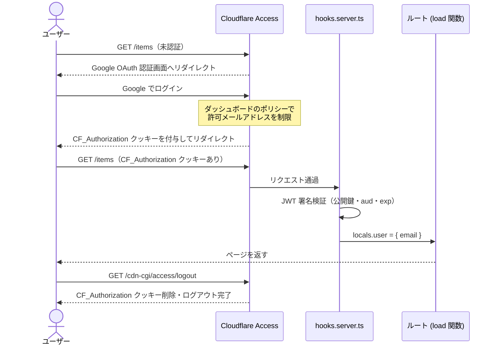
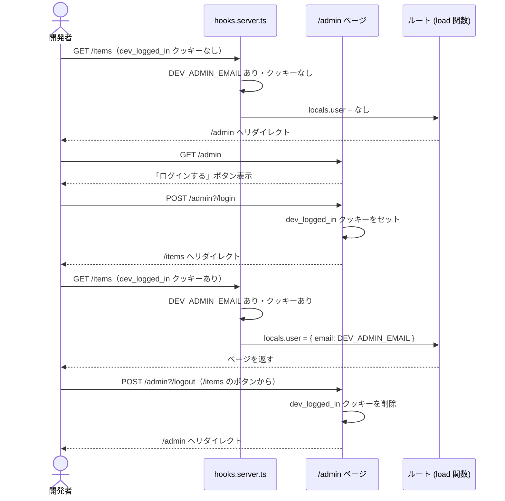

# 認証フロー: ローカル開発 vs 本番

## 本番環境

### メールアドレス制限について（本番）

| レイヤー | 現状 |
|---|---|
| Cloudflare Access ポリシー | ダッシュボードで許可メールを設定済みであれば有効 |
| アプリ側（hooks.server.ts） | **制限なし**。JWT 署名が有効なメールはすべて受け入れる |

> **メモ:** アプリ側にメール許可リストは実装していない。Cloudflare Access ポリシーで許可メールアドレスを指定しておけば、それ以外のアカウントはJWTが発行されないため、ポリシーが正しく設定されていれば個人利用では十分。

---

## ローカル開発環境（疑似認証）

---

## 本番 vs ローカル 対応表

| 項目 | 本番 | ローカル開発（疑似） |
|---|---|---|
| 認証の入口 | Cloudflare Access がインターセプト | wrangler が直接受け取る |
| 認証手段 | Google OAuth | `/admin` ページのボタン |
| セッションの証明 | `CF_Authorization` JWT クッキー（署名あり） | `dev_logged_in` クッキー（値は `"1"`、署名なし） |
| 検証内容 | JWT 署名・aud・exp | クッキーの存在確認のみ |
| メール制限 | Cloudflare Access ポリシーで制御 | `DEV_ADMIN_EMAIL` 環境変数の値を使用 |
| ログアウト | `/cdn-cgi/access/logout` | `/admin?/logout` アクション |

---

## ルート別アクセス制御

| ルート | 認証 | 備考 |
|---|---|---|
| `/p/[id]` | 不要 | `isPublic` フラグが true のアイテムのみ表示 |
| `/items` | 不要 | 誰でも閲覧可。FAB等の操作UIは `data.user` がある場合のみ表示 |
| `/items/[id]` | 必要 | 未認証なら `/admin` へリダイレクト |
| `/items/new` | 必要 | 未認証なら `/admin` へリダイレクト |
| `/api/*` | 必要 | 現状は明示的ガードなし・要実装 |

---

## 環境変数

| 変数 | 環境 | 用途 |
|---|---|---|
| `CF_ACCESS_AUD` | 本番 | Cloudflare Access の Audience Tag |
| `CF_ACCESS_TEAM_DOMAIN` | 本番 | チームドメイン（例: `myteam`） |
| `DEV_ADMIN_EMAIL` | ローカル | 疑似ログイン時のメールアドレス。この値がある場合に疑似認証モードが有効 |
