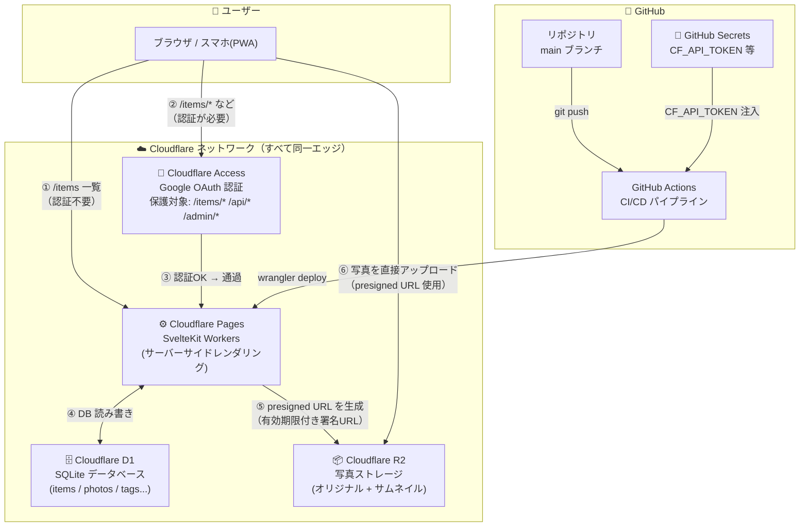
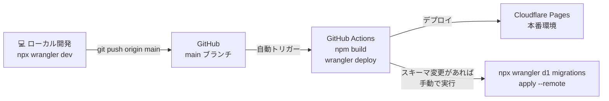

# Cloudflare セットアップガイド

> Cloudflare 初めての方向け。システム構成・デプロイフロー・シークレット管理の選択肢を説明します。

---

## システム構成図



### ポイント解説

| 番号 | 説明 |
|------|------|
| ① | `/items` 一覧は認証不要（未ログイン時は `isPublic` のアイテムのみ表示） |
| ② | `/items/*`・`/api/*`・`/admin` へのアクセスは Cloudflare Access が Google ログインを要求 |
| ③ | メールアドレスが許可リストにあればアクセス通過 |
| ④ | D1 は Cloudflare のエッジ内にあるため低遅延 |
| ⑤ | R2 の認証情報はサーバー（Workers）側にしか存在しない。ブラウザには署名済み URL のみ渡す |
| ⑥ | 写真のバイナリデータは Workers を経由しない → Workers のメモリ制限を回避 |

---

## デプロイフロー

### 初回セットアップ（一度だけ）

上から順に実行する。

---

**① Cloudflare アカウント作成**

🌐 `https://cloudflare.com` でアカウント作成

---

**② wrangler ログイン**

💻 ターミナル:
```bash
npx wrangler login
```

---

**③ D1 データベース作成**

💻 ターミナル:
```bash
npx wrangler d1 create figurine-catalog-db
```
出力された `database_id`（UUID形式）をメモ。次のステップで使用する。

---

**④ wrangler.toml を更新してコミット**

📝 エディタ: `wrangler.toml` の `database_id = "REPLACE_AFTER_CREATION"` を③の値に書き換えてコミット。

---

**⑤ R2 バケット作成**

💻 ターミナル:
```bash
npx wrangler r2 bucket create figurine-catalog-photos
```

---

**⑥ R2 API トークン取得**

🌐 `https://dash.cloudflare.com` → R2 → **Manage R2 API Tokens** → **Create API Token**
- Permissions: **Object Read & Write**
- Specify bucket: `figurine-catalog-photos`

表示される `Access Key ID` と `Secret Access Key` をメモ（**再表示不可**）。

---

**⑦ ローカル動作確認**

💻 ターミナル（README の手順に従いローカルで動作確認済みであること）:
```bash
npx wrangler d1 migrations apply figurine-catalog-db --local
npm run build && npx wrangler pages dev .svelte-kit/cloudflare
```

---

**⑧ GitHub リポジトリを作成して push**

💻 ターミナル:
```bash
git remote add origin https://github.com/<your-username>/figurine-catalog.git
git push -u origin main
```

---

**⑨ Cloudflare Pages プロジェクト作成**

🌐 `https://dash.cloudflare.com` → Pages → **Create a project** → **Connect to Git** → リポジトリを選択

| 設定項目 | 値 |
|----------|-----|
| フレームワーク プリセット | SvelteKit |
| Build command | `npm run build` |
| Build output directory | `.svelte-kit/cloudflare` |

> 「ルート ディレクトリ (アドバンスド)」「環境変数 (アドバンスド)」は設定不要。

---

**⑩ カスタムドメイン・セキュリティ設定**

カスタムドメインを使用する場合はここで設定する。使用しない場合はスキップして ⑪ へ進む。

**カスタムドメインの購入（未取得の場合）**

🌐 `https://dash.cloudflare.com` → ドメイン登録 → 新しいドメインを検索 → 購入

**ドメインのセキュリティ設定**

購入後、以下を確認・設定する:

| 設定 | 場所 | 内容 |
|------|------|------|
| WHOIS プライバシー保護 | 自動適用済み | 登録者情報が非公開になっていることを確認 |
| ドメインロック（移管ロック） | ドメイン登録 → 該当ドメイン | デフォルトで有効のはず。有効になっているか確認 |
| DNSSEC | ドメイン登録 → 該当ドメイン → **DNSSEC** | 有効化する（DNS改ざん防止） |

**Pages へのカスタムドメイン追加**

🌐 Pages → `figurine-catalog` → Settings → **Custom domains** → 「Set up a custom domain」→ 購入したドメインを入力

> カスタムドメインを設定した場合、⑯ の「宛先」ドメインを `.pages.dev` ではなくカスタムドメインに変更すること。

**Bot Fight Mode の有効化**

🌐 `https://dash.cloudflare.com` → 該当ドメインを選択 → セキュリティ → ボット → **Bot Fight Mode をオン**

> Bot Fight Mode はカスタムドメインに紐づく設定のため、`.pages.dev` のみの場合は設定不可。

---

**⑪ D1・R2 バインディングを設定**

🌐 Pages → `figurine-catalog` → Settings → **Functions**

- **D1 database bindings**: Variable name `DB` → `figurine-catalog-db`
- **R2 bucket bindings**: Variable name `R2` → `figurine-catalog-photos`

---

**⑫ 本番シークレットを Pages 環境変数に設定**

🌐 Pages → `figurine-catalog` → Settings → **Environment variables**

以下をすべて **Encrypt ON** で登録する:

| 変数名 | 値 |
|--------|-----|
| `CLOUDFLARE_ACCOUNT_ID` | ダッシュボード右サイドバー下部の ID |
| `R2_ACCESS_KEY_ID` | ⑥で取得した Access Key ID |
| `R2_SECRET_ACCESS_KEY` | ⑥で取得した Secret Access Key |

> `R2_BUCKET_NAME` と `R2_KEY_PREFIX` は `wrangler.toml` の `[vars]` に記載済みのため設定不要。

---

**⑬ 本番 D1 にマイグレーション適用**

💻 ターミナル:
```bash
npx wrangler d1 migrations apply figurine-catalog-db --remote
```

> ✅ **動作確認①** `https://dash.cloudflare.com` → Pages → `figurine-catalog` に表示されている `.pages.dev` の URL にアクセスし、サイトが正常に表示されることを確認する。この時点では認証なしですべてのページにアクセスできる状態が正常。

---

**⑭ Zero Trust 初期設定（チーム名の設定）**

🌐 `https://one.dash.cloudflare.com` にアクセス → 初回のみチーム名の設定が求められる → 任意のチーム名を入力して完了

> チーム名は `one.dash.cloudflare.com` → **設定** → **チーム名とドメイン** → **チームドメイン** で確認できる（`<team-name>.cloudflareaccess.com` の `<team-name>` 部分）。

---

**⑮ Google IdP 設定**

Google ログインを Cloudflare Access で使えるようにする。

**Google Cloud Console 側:**

1. 🌐 `https://console.cloud.google.com` にアクセス → 新規プロジェクトを作成

2. 左サイドメニュー → **「OAuth同意画面」** → 「Google Auth Platform はまだ構成されていません」と表示される → **「開始」** をクリック

   | 項目 | 値 |
   |------|-----|
   | アプリ情報（アプリ名） | `figurine-catalog`（任意） |
   | アプリ情報（サポートメール） | 自分のGoogleアカウントのメールアドレス |
   | 対象 | External（外部） |
   | 連絡先情報 | 自分のメールアドレス |

   入力後「完了」または「保存」で次へ進む。

3. 「OAuth の概要」ページ → **「OAuth クライアントを作成」** をクリック

   | 項目 | 値 |
   |------|-----|
   | アプリケーションの種類 | ウェブアプリケーション |
   | 承認済みの JavaScript 生成元 | `https://<team-name>.cloudflareaccess.com` |
   | 承認済みのリダイレクト URI | `https://<team-name>.cloudflareaccess.com/cdn-cgi/access/callback` |

   `<team-name>` は ⑭ で設定したチーム名。

   作成後に表示される **クライアントID** と **クライアントシークレット** をメモ（再表示可能だが控えておくこと）。

**Zero Trust 側:**

🌐 `https://one.dash.cloudflare.com` → インテグレーション → IDプロバイダー → **「IDプロバイダーを追加する」** → Google を選択

| 項目 | 値 |
|------|-----|
| 名前 | `Google`（任意の識別名） |
| アプリID | 上記で取得したクライアントID |
| クライアントシークレット | 上記で取得したクライアントシークレット |

保存後、一覧の「テスト」ボタンで Google 認証が正常に動作するか確認する。

---

**⑯ Cloudflare Access 設定**

`/items/*`, `/api/*`, `/admin/*` を Google ログイン保護にする。

🌐 `https://one.dash.cloudflare.com` → 左パネルの **Zero Trust** → Accessコントロール → アプリケーション → **「アプリケーションを追加する」** → **「セルフホストとプライベートで実行」** を選択

「アプリケーションの詳細」タブ内で以下を設定する:

**「詳細」セクション**

| 項目 | 値 |
|------|-----|
| 名前（必須） | `figurine-catalog` |
| セッション期間（必須） | `24時間`（お好みで） |

**「宛先」セクション**（パブリックホスト名）

| 項目 | 値 |
|------|-----|
| サブドメイン | 空欄 |
| ドメイン（必須） | カスタムドメイン（⑩ で設定した場合）または `<your-pages-domain>.pages.dev` |

「パスを追加する」で以下を1件ずつ追加:
```
/items/*
/admin
/admin/*
/api
/api/*
```

**「Accessポリシー」セクション**

| 項目 | 値 |
|------|-----|
| ポリシー名 | `Owner only` |
| アクション | 許可 |
| 含める（ルール） | メール → 自分のGoogleアカウントのメールアドレス |

**「認証」セクション**

⑮ で追加した `Google` を選択する。

**その他のセクション（デフォルトのままでOK）**

「ブラウザベースのRDP/SSH/VNCアクセスを許可する」「ポリシーテスター」「プレビュー」は変更不要。

設定完了後「保存する」をクリック。

> ✅ **動作確認②** カスタムドメイン（`https://gallery.hakuworx.com`）にアクセスし、Googleログイン画面にリダイレクトされることを確認する。ログイン後に `/items` 一覧・詳細ページが正常に表示されることも確認する。

---

**⑰ .pages.dev URL のバルクリダイレクト設定**

Cloudflare Access はカスタムドメインのみを保護するため、`figurine-catalog.pages.dev` には認証なしでアクセスできてしまう。一括リダイレクトでカスタムドメインへ転送することで迂回を防ぐ。

🌐 `https://dash.cloudflare.com` → 配信とパフォーマンス → **一括リダイレクト**

**1. リダイレクトリストの作成**

「一括リダイレクトリストの作成」をクリックし、以下を入力:

| 項目 | 値 | 備考 |
|------|-----|------|
| リスト名 | `pages-dev-redirect`（任意） | |
| リダイレクト元（Source URL） | `figurine-catalog.pages.dev` | `https://` は不要。UI が自動で末尾スラッシュを補完するが問題なし |
| リダイレクト先（Target URL） | `https://gallery.hakuworx.com` | |
| **Subpath Matching** | **有効（ON）** | **これを有効にしないと `/items` などサブパスがリダイレクトされない** |

> **注意:** エントリは1件だけ登録すること。`https://` あり・なしで2件登録すると競合する場合がある。

**2. リダイレクトルールの作成**

リスト作成後、「一括リダイレクトルールの作成」から上記リストを選択して**「保存してデプロイ」**をクリックする。

> **注意:** リストの内容を後から変更した場合も、ルール側で「保存してデプロイ」を再実行しないと変更が反映されない。

> 設定後、`https://figurine-catalog.pages.dev` および `https://figurine-catalog.pages.dev/items` にアクセスすると `https://gallery.hakuworx.com` にリダイレクトされることを確認する。

---

**⑱ JWT 署名検証の設定**

Cloudflare Access が付与する JWT をサーバー側で検証するための設定。未設定の場合、Cloudflare Access は通過できてもアプリ内で「未ログイン」扱いになり管理機能が使えない。**本番運用には必ず設定すること。**

**AUD Tag の確認:**

🌐 `https://one.dash.cloudflare.com` → **Zero Trust** → **Access コントロール** → **アプリケーション** → `figurine-catalog` を選択 → **設定** → **追加設定** タブ → 「アプリケーション オーディエンス (AUD) タグ」のトークン値をメモ

**Pages 環境変数に登録:**

🌐 Pages → `figurine-catalog` → Settings → **Environment variables**

| 変数名 | 値 | Encrypt |
|--------|-----|---------|
| `CF_ACCESS_TEAM_DOMAIN` | ⑭ のチーム名（`<team-name>.cloudflareaccess.com` の `<team-name>` 部分） | OFF |
| `CF_ACCESS_AUD` | 上記で確認した AUD Tag | **ON** |

---

✅ **デプロイ完了**

### 継続的デプロイ（2回目以降）



> **注意:** D1 マイグレーションは自動実行されません。スキーマ変更時は手動で `--remote` を実行してください。

---

## シークレット管理（重要）

### 絶対にコードに含めてはいけない情報

```
CLOUDFLARE_ACCOUNT_ID     # Cloudflare アカウント ID
R2_ACCESS_KEY_ID          # R2 API アクセスキー
R2_SECRET_ACCESS_KEY      # R2 API シークレットキー
```

---

### 管理場所の選択肢

#### 選択肢 A: Cloudflare Pages 環境変数（推奨・最もシンプル）

**仕組み:**
- Cloudflare ダッシュボード上で設定 → 暗号化されてCloudflareのシステム内に保存
- コードにも `.env` ファイルにも存在しない
- Claude Code を含むどのツールからも読み取り不可

**メリット:** シンプル、追加ツール不要、暗号化済み
**デメリット:** CI/CD（GitHub Actions）では直接使えない（GitHub→CF間のデプロイは Pages が自動でやるのでそもそも不要）

---

#### 選択肢 B: GitHub Actions Secrets + wrangler deploy（CI/CDで使う場合）

**仕組み:**
- GitHub Secrets に `CLOUDFLARE_API_TOKEN` を保存
- GitHub Actions が `wrangler deploy` する際に注入
- R2の認証情報は Cloudflare 側の環境変数に設定

**設定場所:**
```
GitHub → リポジトリ → Settings → Secrets and variables → Actions
  → CLOUDFLARE_API_TOKEN    （Cloudflare API トークン）
  → CLOUDFLARE_ACCOUNT_ID   （必要に応じて）
```

```yaml
# .github/workflows/deploy.yml の例
name: Deploy
on:
  push:
    branches: [main]
jobs:
  deploy:
    runs-on: ubuntu-latest
    steps:
      - uses: actions/checkout@v4
      - uses: actions/setup-node@v4
        with: { node-version: 20 }
      - run: npm ci && npm run build
      - uses: cloudflare/wrangler-action@v3
        with:
          apiToken: ${{ secrets.CLOUDFLARE_API_TOKEN }}
          # R2の認証情報はCloudflareのPages環境変数に設定済みのため不要
```

**メリット:** デプロイが完全自動化、GitHub で一元管理
**デメリット:** 初期設定がやや多い

---

#### 選択肢 C: .dev.vars（ローカル開発専用）

`wrangler dev` 実行時のみ有効なローカル専用ファイル。本番環境には影響しない。

```bash
# .dev.vars（プロジェクトルートに作成、絶対に git commit しない）
CLOUDFLARE_ACCOUNT_ID=your_account_id
R2_ACCESS_KEY_ID=your_access_key
R2_SECRET_ACCESS_KEY=your_secret_key
R2_BUCKET_NAME=figurine-catalog-photos
```

> ⚠️ **Claude Code への注意:** `.dev.vars` はローカルファイルなので Claude Code が読める可能性があります。Claude Code を使った開発中はターミナルで環境変数として export する方法（下記）の方が安全です。

```bash
# シェルのセッション変数として設定（ファイルに書かない）
export CLOUDFLARE_ACCOUNT_ID="your_account_id"
export R2_ACCESS_KEY_ID="your_access_key"
export R2_SECRET_ACCESS_KEY="your_secret_key"
npx wrangler dev
```

---

### 推奨構成まとめ

| 用途 | 保存場所 | Claude Code から読める? |
|------|---------|----------------------|
| ローカル開発 | シェルの `export` 変数 | ❌ 読めない（ファイルなし） |
| ローカル開発（代替） | `.dev.vars`（.gitignore済み） | ⚠️ 読める可能性あり |
| CI/CD | GitHub Actions Secrets | ❌ 読めない |
| 本番 | Cloudflare Pages 環境変数（暗号化） | ❌ 読めない |

---

## Cloudflare API トークンの作成方法

GitHub Actions から `wrangler deploy` するには専用の API トークンが必要（選択肢Bを採用する場合）。

```
Cloudflare ダッシュボード
  → My Profile（右上アイコン）
  → API Tokens
  → Create Token
  → "Edit Cloudflare Workers" テンプレートを選択
  → Zone Resources: All zones（または特定ドメイン）
  → Continue to summary → Create Token
```

作成されたトークンを **GitHub Secrets の `CLOUDFLARE_API_TOKEN`** に保存する。
