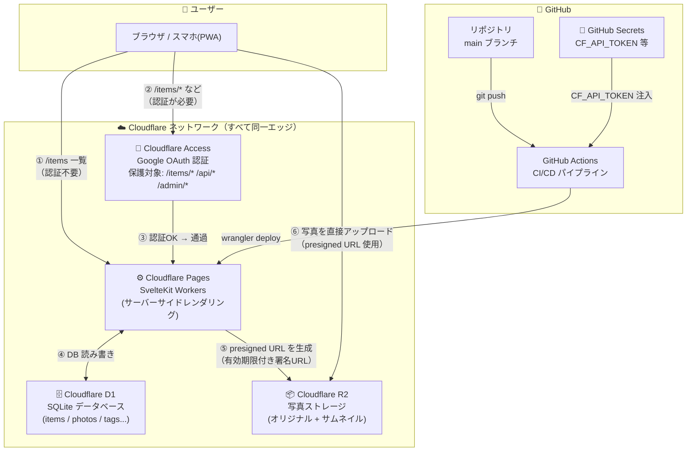
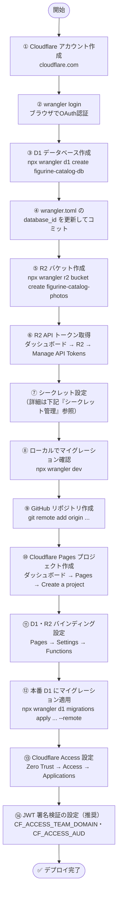
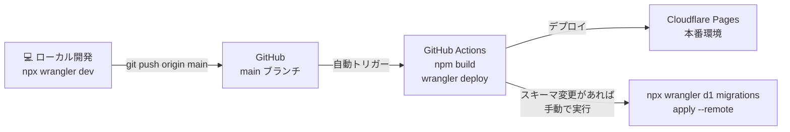
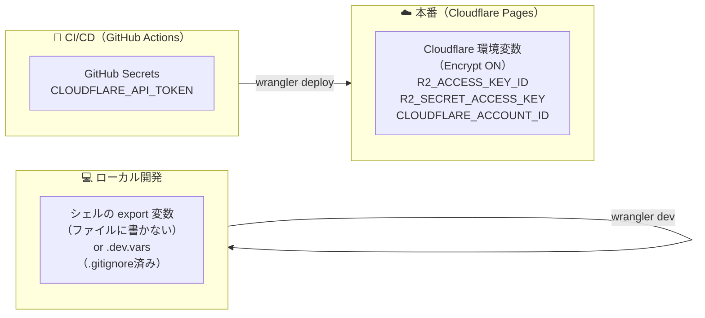

# Cloudflare セットアップガイド

> Cloudflare 初めての方向け。システム構成・デプロイフロー・シークレット管理の選択肢を説明します。

---

## システム構成図



### ポイント解説

| 番号 | 説明 |
|------|------|
| ① | `/items` 一覧は認証不要（未ログイン時は `isPublic` のアイテムのみ表示） |
| ② | `/items/*`・`/api/*`・`/admin` へのアクセスは Cloudflare Access が Google ログインを要求 |
| ③ | メールアドレスが許可リストにあればアクセス通過 |
| ④ | D1 は Cloudflare のエッジ内にあるため低遅延 |
| ⑤ | R2 の認証情報はサーバー（Workers）側にしか存在しない。ブラウザには署名済み URL のみ渡す |
| ⑥ | 写真のバイナリデータは Workers を経由しない → Workers のメモリ制限を回避 |

---

## デプロイフロー

### 初回セットアップ（一度だけ）



### 継続的デプロイ（2回目以降）



> **注意:** D1 マイグレーションは自動実行されません。スキーマ変更時は手動で `--remote` を実行してください。

---

## シークレット管理（重要）

### 絶対にコードに含めてはいけない情報

```
CLOUDFLARE_ACCOUNT_ID     # Cloudflare アカウント ID
R2_ACCESS_KEY_ID          # R2 API アクセスキー
R2_SECRET_ACCESS_KEY      # R2 API シークレットキー
```

---

### 管理場所の選択肢

#### 選択肢 A: Cloudflare Pages 環境変数（推奨・最もシンプル）

**仕組み:**
- Cloudflare ダッシュボード上で設定 → 暗号化されてCloudflareのシステム内に保存
- コードにも `.env` ファイルにも存在しない
- Claude Code を含むどのツールからも読み取り不可

**設定場所:**
```
Cloudflare ダッシュボード
  → Pages
  → figurine-catalog
  → Settings
  → Environment variables
  → Add variable（Encrypt をオン）
```

**メリット:** シンプル、追加ツール不要、暗号化済み
**デメリット:** CI/CD（GitHub Actions）では直接使えない（GitHub→CF間のデプロイは Pages が自動でやるのでそもそも不要）

---

#### 選択肢 B: GitHub Actions Secrets + wrangler deploy（CI/CDで使う場合）

**仕組み:**
- GitHub Secrets に `CLOUDFLARE_API_TOKEN` を保存
- GitHub Actions が `wrangler deploy` する際に注入
- R2の認証情報は Cloudflare 側の環境変数に設定

**設定場所:**
```
GitHub → リポジトリ → Settings → Secrets and variables → Actions
  → CLOUDFLARE_API_TOKEN    （Cloudflare API トークン）
  → CLOUDFLARE_ACCOUNT_ID   （必要に応じて）
```

```yaml
# .github/workflows/deploy.yml の例
name: Deploy
on:
  push:
    branches: [main]
jobs:
  deploy:
    runs-on: ubuntu-latest
    steps:
      - uses: actions/checkout@v4
      - uses: actions/setup-node@v4
        with: { node-version: 20 }
      - run: npm ci && npm run build
      - uses: cloudflare/wrangler-action@v3
        with:
          apiToken: ${{ secrets.CLOUDFLARE_API_TOKEN }}
          # R2の認証情報はCloudflareのPages環境変数に設定済みのため不要
```

**メリット:** デプロイが完全自動化、GitHub で一元管理
**デメリット:** 初期設定がやや多い

---

#### 選択肢 C: wrangler secret put（Workersのみ）

**仕組み:**
- `wrangler secret put` コマンドで値を入力 → Cloudflare のシステムに暗号化保存
- Workers/Pages のランタイムでのみ `platform.env.KEY` でアクセス可能

```bash
npx wrangler secret put CLOUDFLARE_ACCOUNT_ID
# → プロンプトが出るので値を入力（エコーなし）
npx wrangler secret put R2_ACCESS_KEY_ID
npx wrangler secret put R2_SECRET_ACCESS_KEY
```

**注意:** Pages の場合は `wrangler secret put` ではなく **ダッシュボードの環境変数**（選択肢A）を推奨。`wrangler secret` は主に Workers 向け。

---

#### 選択肢 D: .dev.vars（ローカル開発専用）

`wrangler dev` 実行時のみ有効なローカル専用ファイル。本番環境には影響しない。

```bash
# .dev.vars（プロジェクトルートに作成、絶対に git commit しない）
CLOUDFLARE_ACCOUNT_ID=your_account_id
R2_ACCESS_KEY_ID=your_access_key
R2_SECRET_ACCESS_KEY=your_secret_key
R2_BUCKET_NAME=figurine-catalog-photos
```

```bash
# .gitignore に追加済みか確認
echo ".dev.vars" >> .gitignore
```

> ⚠️ **Claude Code への注意:** `.dev.vars` はローカルファイルなので Claude Code が読める可能性があります。Claude Code を使った開発中はターミナルで環境変数として export する方法（下記）の方が安全です。

```bash
# シェルのセッション変数として設定（ファイルに書かない）
export CLOUDFLARE_ACCOUNT_ID="your_account_id"
export R2_ACCESS_KEY_ID="your_access_key"
export R2_SECRET_ACCESS_KEY="your_secret_key"
npx wrangler dev
```

---

### 推奨構成まとめ



| 用途 | 保存場所 | Claude Code から読める? |
|------|---------|----------------------|
| ローカル開発 | シェルの `export` 変数 | ❌ 読めない（ファイルなし） |
| ローカル開発（代替） | `.dev.vars`（.gitignore済み） | ⚠️ 読める可能性あり |
| CI/CD | GitHub Actions Secrets | ❌ 読めない |
| 本番 | Cloudflare Pages 環境変数（暗号化） | ❌ 読めない |

---

## Cloudflare API トークンの作成方法

GitHub Actions から `wrangler deploy` するには専用の API トークンが必要。

```
Cloudflare ダッシュボード
  → My Profile（右上アイコン）
  → API Tokens
  → Create Token
  → "Edit Cloudflare Workers" テンプレートを選択
  → Zone Resources: All zones（または特定ドメイン）
  → Continue to summary → Create Token
```

作成されたトークンを **GitHub Secrets の `CLOUDFLARE_API_TOKEN`** に保存する。

---

## Cloudflare Access の設定方法

`/items/*`, `/api/*`, `/admin/*` をパスワードなしで Google ログイン保護にする。

```
Cloudflare Zero Trust（one.dash.cloudflare.com）
  → Access
  → Applications
  → Add an application
  → Self-hosted

設定項目:
  Application name: figurine-catalog
  Session Duration: 24 hours（お好みで）
  Application domain: <your-pages-domain>.pages.dev

  Path を追加:
    /items/*
    /admin
    /admin/*
    /api
    /api/*

Policies:
  Policy name: Owner only
  Action: Allow
  Include: Emails → あなたのGoogleアカウントのメールアドレス
```

> `<your-pages-domain>` は Pages プロジェクト作成時に決まります（例: `figurine-catalog-abc.pages.dev`）。カスタムドメインを使う場合はそちらを設定。

---

## JWT 署名検証の設定（推奨）

Cloudflare Access が付与する JWT をサーバー側で署名検証するために、以下の環境変数を Pages に追加する。

### 設定する値

| 変数名 | 値 | 設定場所 |
|--------|-----|---------|
| `CF_ACCESS_TEAM_DOMAIN` | `your-team`（`your-team.cloudflareaccess.com` の前半部分） | Pages 環境変数（非シークレット） |
| `CF_ACCESS_AUD` | AUD Tag（下記参照） | Pages 環境変数（**Encrypt ON**） |

**AUD Tag の確認場所:**
```
Cloudflare Zero Trust
  → Access → Applications → 該当アプリ → Overview
  → AUD Tag
```

### 設定手順

```bash
# CF_ACCESS_TEAM_DOMAIN は wrangler.toml の [vars] に追記しても可（非シークレット）
# CF_ACCESS_AUD はシークレットとして登録
wrangler secret put CF_ACCESS_AUD --env production
```

または Cloudflare ダッシュボード → Pages → Settings → Environment variables から直接入力（Encrypt ON）。

> **未設定の場合:** JWT の署名検証をスキップして base64 デコードのみ行うフォールバックモードで動作します（コンソールに警告が出力されます）。
